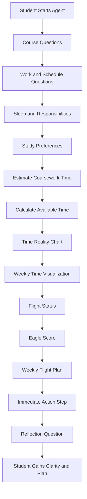

# 🦅 Eagle Flight Plan

Eagle Flight Plan is a student-centered AI agent designed to help learners determine whether their course schedule realistically fits their available time.

It guides students through a structured reflection on their academic workload and life responsibilities, then provides clear, actionable insights to support better planning and decision-making.

---

## 🎯 Purpose

Many students struggle not because of ability, but because their time is overcommitted.

Eagle Flight Plan helps students:
- Understand how much time their courses actually require
- Compare that workload to their real-life availability
- Identify whether their schedule is sustainable
- Take practical steps to improve time management

---

## ⚙️ What the Agent Does

The agent walks students through a step-by-step evaluation:

1. **Collects Information**
   - Courses and course types
   - Work schedule and commute
   - Sleep habits
   - Personal responsibilities

2. **Estimates Coursework Time**
   - Uses standard time ranges based on course type

3. **Calculates Available Time**
   - Based on a 168-hour week model

4. **Generates Outputs**
   - **Time Reality Chart** (weekly breakdown)
   - **Weekly Time Visualization**
   - **Flight Status**
   - **Eagle Score**
   - **Weekly Flight Plan**
   - **Reflection Question**

## How Eagle Flight Plan Works

## ✈️ Flight Status System

Students receive a clear status based on their available time:

- 🟢 **Safe Zone — Ready to Soar**  
  Schedule is manageable with a healthy time buffer

- 🟡 **Caution Zone — Tight Flight Path**  
  Limited buffer; requires careful planning

- 🔴 **Danger Zone — Overloaded Schedule**  
  Coursework exceeds available time; adjustments recommended

---

## 🧮 Eagle Score

A simple score (0–100) that reflects how balanced a student’s schedule is:

- **80–100:** Strong Balance  
- **60–79:** Manageable but Tight  
- **40–59:** High Risk  
- **Below 40:** Overloaded  

The score helps students quickly interpret their situation while reinforcing the detailed breakdown.

---

## 📊 Example Output

### Weekly Time Breakdown

- Sleep: 56 hours  
- Work: 40 hours  
- Commute: 5 hours  
- Responsibilities: 20 hours  
- Coursework: 24 hours  

**Remaining flexible time:** 23 hours  

### Weekly Time Budget
Sleep: ████████████████████ 56 hrs
Work: ███████████████ 40 hrs
Coursework: ██████████ 24 hrs
Responsibilities: ███████ 20 hrs
Commute: ██ 5 hrs
Remaining flexible time: ████ 23 hrs

---

## 🧭 Weekly Flight Plan

The agent helps students build a simple, realistic plan that includes:

- Study blocks (30–90 minutes)
- Course rotation across the week
- A weekly planning session
- A catch-up buffer

The focus is on consistency over cramming.

---

## 💬 Suggested Prompts

- *Check my schedule.*  
- *Too many classes?*  
- *Work + School Check*  
- *Course Time Estimate*  
- *Build my weekly plan*  
- *I feel overwhelmed*

---

## 🧠 Design Principles

- **Human-centered:** Supports decision-making, not automation  
- **Transparent:** All estimates are explained  
- **Structured:** Step-by-step questioning reduces overwhelm  
- **Actionable:** Every interaction ends with a next step  
- **Supportive:** Encouraging, never judgmental  

---

## 🛠️ Implementation Notes

- Built in **Microsoft Copilot Studio**
- No external knowledge sources required
- Relies on guided prompts and time estimation logic
- Designed for integration into LMS environments or advising workflows

---

## 🎓 Use Cases

- First-year student success courses  
- Academic advising conversations  
- Online course onboarding  
- Time management interventions  
- Early alert and retention strategies  

---

## 🚀 Future Enhancements

- LMS integration (Blackboard, Canvas)
- Data-informed refinements based on student usage
- Expanded agent ecosystem (study planning, project planning, AI literacy)

---

## ✨ Author

Jennifer Lee  
IT Instructor | AI in the Classroom | EdD Candidate  

---

## 🧭 Philosophy

Helping students succeed starts with helping them see their time clearly.

---

## Attribution

*Built with Copilot using Claude Opus 4.6*
